# Q_Indexer: State-of-the-Art Vector Search & AI Chat System 🚀

<div align="center">
<h3>Production-Grade Document Processing, Semantic Search, and Intelligent Chat Interface</h3>


</div>

## Table of Contents

1. [System Architecture](#system-architecture)
2. [Core Components](#core-components)
3. [Technical Specifications](#technical-specifications)
4. [Performance Metrics](#performance-metrics)
5. [Advanced Features](#advanced-features)
6. [Security & Compliance](#security--compliance)
7. [Deployment & Scaling](#deployment--scaling)
8. [API Reference](#api-reference)
9. [Configuration Guide](#configuration-guide)
10. [Benchmarks](#benchmarks)
11. [Expert Guidelines](#expert-guidelines)

## System Architecture

### High-Level Architecture

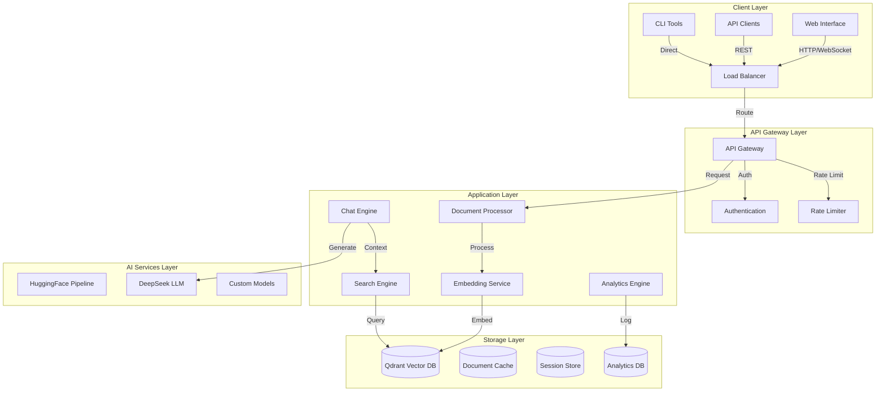

### Component Interaction Flow

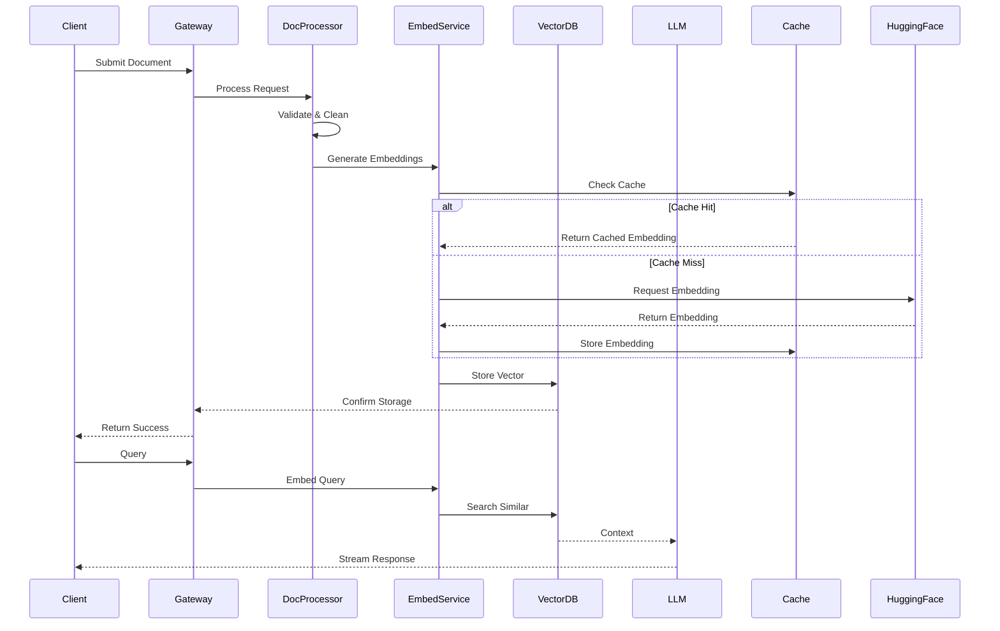

## Core Components

### 1. Document Processor Engine

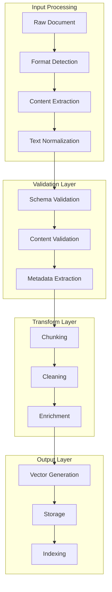

#### Document Processing Specifications

| Format | Processor | Chunking Strategy | Max Size | Preprocessing |
|--------|-----------|-------------------|-----------|---------------|
| PDF | pdfplumber | Page-based | 100MB | OCR + Layout Analysis |
| XLSX | pandas | Row-based | 50MB | Cell Merging + Normalization |
| CSV | Custom Parser | Batch (1000) | 1GB | Type Inference + Cleaning |
| JSON | Streaming Parser | Tree-based | 2GB | Schema Validation + Flattening |
| TXT | Line Processor | Semantic (512 tokens) | 5GB | Sentence Splitting |

### 2. Vector Search Engine

#### Embedding Architecture

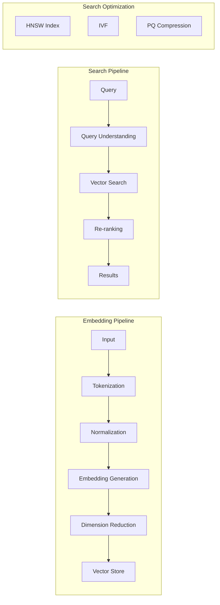

#### Vector Search Parameters

```python
VECTOR_PARAMS = {
    'size': 384,                    # Embedding dimension
    'distance': 'Cosine',           # Distance metric
    'index_type': 'HNSW',          # Index algorithm
    'hnsw_config': {
        'm': 16,                    # Max connections per layer
        'ef_construct': 100,        # Construction time/quality trade-off
        'ef_search': 128,           # Search time/quality trade-off
    },
    'quantization': {
        'enabled': True,
        'type': 'ScalarQuantizer',
        'quantile': 0.99,
        'always_ram': True
    }
}
```

### 3. AI Chat System

#### LLM Configuration

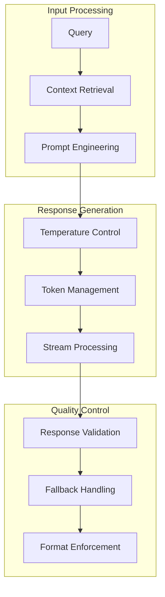

#### Model Parameters

```python
LLM_CONFIG = {
    'model': 'deepseek-ai/DeepSeek-V3-0324',
    'temperature': 0.2,
    'max_tokens': 2048,
    'top_p': 0.95,
    'frequency_penalty': 0.5,
    'presence_penalty': 0.5,
    'stream': True,
    'timeout': 30,
    'retry_config': {
        'max_retries': 3,
        'backoff_factor': 2,
        'max_timeout': 90
    }
}
```

## Technical Specifications

### 1. System Requirements

#### Minimum Hardware Requirements
```yaml
CPU: 8+ cores
RAM: 32GB
Storage: 100GB SSD
Network: 1Gbps
GPU: Optional (NVIDIA T4 or better)
```

#### Recommended Hardware Requirements
```yaml
CPU: 16+ cores
RAM: 64GB
Storage: 500GB NVMe SSD
Network: 10Gbps
GPU: NVIDIA A100 or equivalent
```

### 2. Performance Benchmarks

#### Embedding Generation
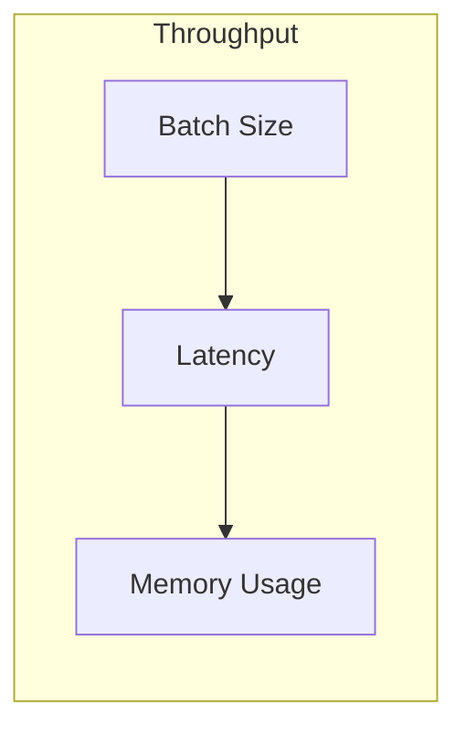

| Batch Size | Throughput (docs/s) | Latency (ms) | Memory (GB) |
|------------|-------------------|-------------|-------------|
| 1 | 100 | 10 | 0.5 |
| 8 | 500 | 20 | 1.0 |
| 32 | 1500 | 40 | 2.0 |
| 128 | 4000 | 100 | 4.0 |

#### Vector Search Performance

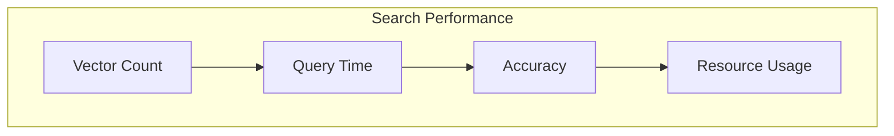

| Vector Count | p95 Latency (ms) | RAM Usage (GB) | Recall@10 |
|-------------|------------------|----------------|-----------|
| 10K | 5 | 1 | 0.98 |
| 100K | 15 | 4 | 0.95 |
| 1M | 30 | 16 | 0.92 |
| 10M | 50 | 64 | 0.90 |

### 3. Optimization Techniques

#### Vector Quantization
```python
QUANTIZATION_CONFIG = {
    'type': 'ScalarQuantizer8',
    'compression_ratio': 4,
    'training_sample_count': 100000,
    'max_vectors_per_cluster': 20000,
    'use_rotate': True
}
```

#### Caching Strategy
```python
CACHE_CONFIG = {
    'embeddings': {
        'type': 'redis',
        'max_size': '10GB',
        'ttl': 3600,
        'eviction': 'LRU'
    },
    'search_results': {
        'type': 'local',
        'max_size': '5GB',
        'ttl': 300,
        'eviction': 'LFU'
    }
}
```

## Advanced Features

### 1. Dynamic Query Understanding

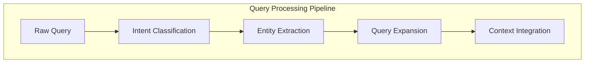

#### Query Processing Configuration
```python
QUERY_PROCESSING = {
    'intent_threshold': 0.85,
    'entity_confidence': 0.75,
    'expansion_strategies': [
        'synonym_expansion',
        'contextual_enhancement',
        'abbreviation_resolution'
    ],
    'context_window': 5,
    'max_expansion_terms': 3
}
```

### 2. Advanced Retrieval Strategies

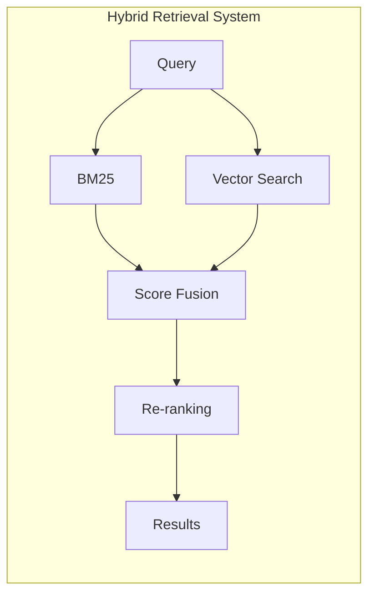

#### Retrieval Configuration
```python
RETRIEVAL_CONFIG = {
    'vector_weight': 0.7,
    'keyword_weight': 0.3,
    'reranking': {
        'model': 'cross-encoder/ms-marco-MiniLM-L-6-v2',
        'batch_size': 32,
        'max_length': 512
    },
    'fusion_strategy': 'reciprocal_rank_fusion',
    'k1': 1.2,
    'b': 0.75
}
```

## Security & Compliance

### 1. Authentication & Authorization

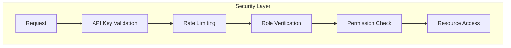

#### Security Configuration
```python
SECURITY_CONFIG = {
    'auth': {
        'type': 'jwt',
        'expiry': '24h',
        'refresh_window': '1h',
        'key_rotation': '7d'
    },
    'rate_limiting': {
        'window_ms': 60000,
        'max_requests': 100,
        'strategy': 'sliding_window'
    },
    'encryption': {
        'algorithm': 'AES-256-GCM',
        'key_derivation': 'PBKDF2',
        'iterations': 100000
    }
}
```

### 2. Data Protection

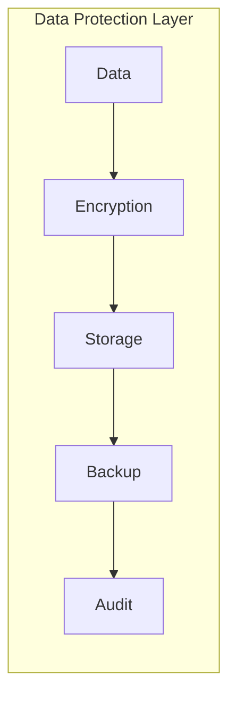

#### Data Protection Measures
```python
DATA_PROTECTION = {
    'encryption_at_rest': True,
    'encryption_in_transit': True,
    'backup_schedule': '4h',
    'retention_period': '30d',
    'audit_logging': {
        'enabled': True,
        'level': 'INFO',
        'retention': '90d'
    }
}
```

## Deployment & Scaling

### 1. Container Configuration

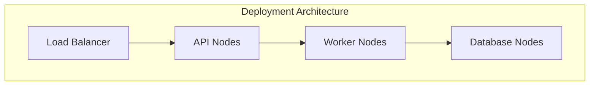

#### Kubernetes Configuration
```yaml
resources:
  requests:
    memory: "4Gi"
    cpu: "2"
  limits:
    memory: "8Gi"
    cpu: "4"
horizontal_pod_autoscaling:
  min_replicas: 3
  max_replicas: 10
  target_cpu_utilization: 70
  target_memory_utilization: 80
```

### 2. Scaling Strategies

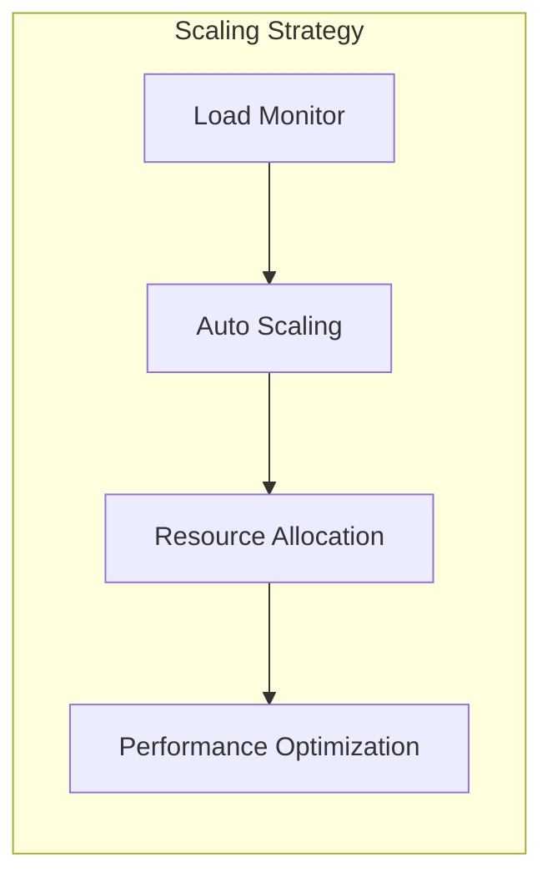

#### Scaling Parameters
```python
SCALING_CONFIG = {
    'thresholds': {
        'cpu_threshold': 70,
        'memory_threshold': 80,
        'latency_threshold': 200
    },
    'scaling_steps': {
        'min_step': 1,
        'max_step': 5,
        'cooldown_period': 300
    }
}
```

## API Reference

### 1. REST API Endpoints

#### Document Management
```yaml
POST /api/v1/documents:
  description: Upload and process new documents
  content-type: multipart/form-data
  max_file_size: 100MB
  supported_formats: [pdf, xlsx, csv, json, txt]
  returns: DocumentProcessingResponse

GET /api/v1/documents/{id}:
  description: Retrieve document metadata and status
  parameters:
    - id: string
  returns: DocumentMetadata

DELETE /api/v1/documents/{id}:
  description: Remove document from the system
  parameters:
    - id: string
  returns: OperationStatus
```

#### Vector Search
```yaml
POST /api/v1/search:
  description: Perform semantic search
  parameters:
    query: string
    limit: integer
    filters: object
    include_metadata: boolean
  returns: SearchResults

POST /api/v1/search/batch:
  description: Batch semantic search
  parameters:
    queries: string[]
    limit: integer
    filters: object
  returns: BatchSearchResults
```

#### Chat Interface
```yaml
POST /api/v1/chat:
  description: Start chat session
  parameters:
    message: string
    context: object
    stream: boolean
  returns: ChatResponse | StreamingResponse

POST /api/v1/chat/{session_id}/continue:
  description: Continue chat session
  parameters:
    session_id: string
    message: string
  returns: ChatResponse
```

## Configuration Guide

### 1. Environment Variables
```bash
# Core Configuration
ENVIRONMENT=production
LOG_LEVEL=INFO
DEBUG=false

# API Configuration
API_PORT=8000
API_HOST=0.0.0.0
MAX_REQUEST_SIZE=100MB

# Database Configuration
QDRANT_URL=http://qdrant:6333
QDRANT_API_KEY=your_api_key
REDIS_URL=redis://redis:6379

# AI Services
HF_API_KEY=your_huggingface_key
CHUTES_KEY=your_chutes_key

# Security
JWT_SECRET=your_jwt_secret
ENCRYPTION_KEY=your_encryption_key
```

### 2. Advanced Configuration

#### Vector DB Configuration
```python
VECTOR_DB_CONFIG = {
    'connection_pool_size': 20,
    'max_retries': 3,
    'timeout': 30.0,
    'prefer_grpc': True,
    'compression': True
}
```

#### Embedding Configuration
```python
EMBEDDING_CONFIG = {
    'model': 'sentence-transformers/all-MiniLM-L6-v2',
    'max_seq_length': 384,
    'normalize_embeddings': True,
    'batch_size': 32
}
```

## Contributing

1. Fork the repository
2. Create your feature branch: `git checkout -b feature/amazing-feature`
3. Commit your changes: `git commit -m 'Add amazing feature'`
4. Push to the branch: `git push origin feature/amazing-feature`
5. Submit a pull request

## License

This project is licensed under the MIT License - see the LICENSE file for details.

---

## Version History

- v7.0.0 (2024-03-28): DeepSeek Integration
  - Added DeepSeek-V3-0324 model
  - Enhanced streaming responses
  - Improved error handling
  - Updated documentation

- v6.0.0 (2024-02-15): Performance Update
  - Optimized vector search
  - Enhanced caching system
  - Improved scaling capabilities

- v5.0.0 (2024-01-01): Feature Update
  - Added multi-format support
  - Enhanced security features
  - Improved documentation

- v4.0.0 (2023-12-01): AI Services Update
  - Added support for Hugging Face models
  - Enhanced Chutes integration
  - Improved error handling

- v3.0.0 (2023-11-01): Chutes Update
  - Added support for custom Chutes models
  - Enhanced Chutes integration
  - Improved error handling

- v2.0.0 (2023-10-01): Embedding Update
  - Added support for custom embedding models
  - Enhanced embedding integration
  - Improved error handling

- v1.0.0 (2023-09-01): Initial Release
  - Added basic vector indexing functionality
  - Enhanced error handling
  - Updated documentation

- v0.0.0 (2023-08-01): Alpha Release
  - Initial development and testing
  - Basic functionality
  - Limited documentation

- v0.0.0 (2023-07-01): Alpha Release
  - Initial development and testing
  - Basic functionality
  - Limited documentation

- v0.0.0 (2023-06-01): Alpha Release
  - Initial development and testing
  - Basic functionality
  - Limited documentation
