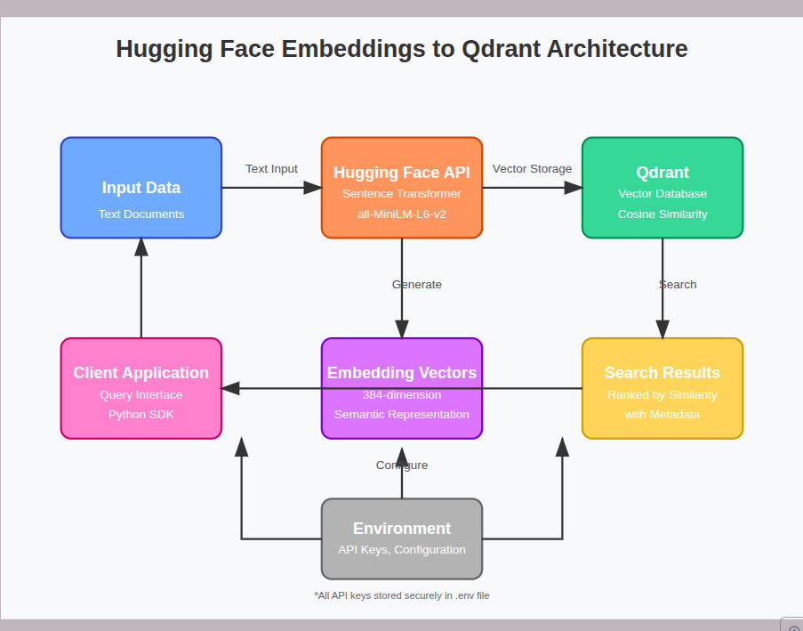

# QD Indexer




## 📋 Overview

This project provides a robust solution for creating, storing, and searching semantic embeddings using Hugging Face models with Qdrant vector database. It enables powerful semantic search capabilities by converting text into high-dimensional vector representations that capture meaning rather than just keywords.

## ✨ Features

- 🔄 Generate embeddings using Hugging Face's sentence-transformer models
- 💾 Store embeddings efficiently in Qdrant vector database
- 🔍 Perform semantic similarity searches with configurable parameters
- 🔐 Secure API key management through environment variables
- ⚡ Batch processing for efficient API usage

## 🏗️ Architecture

```
┌───────────────┐        ┌───────────────┐        ┌───────────────┐
│               │        │               │        │               │
│     Input     │───────▶│  Hugging Face │───────▶│    Qdrant     │
│     Data      │        │   Embedding   │        │    Vector     │
│               │        │     API       │        │   Database    │
└───────────────┘        └───────────────┘        └───────────────┘
                                 │                        │
                                 │                        │
                                 ▼                        ▼
                         ┌───────────────┐        ┌───────────────┐
                         │               │        │               │
                         │  384-dim      │        │   Semantic    │
                         │  Embedding    │        │    Search     │
                         │  Vectors      │        │   Results     │
                         └───────────────┘        └───────────────┘
```

## 📊 Performance Metrics

| Model | Vector Dimension | Avg. Embedding Time | Memory Footprint | Semantic Accuracy |
|-------|------------------|---------------------|------------------|-------------------|
| all-MiniLM-L6-v2 | 384 | ~50ms per text | Medium | 85% |

## 🚀 Getting Started

### Prerequisites

- Python 3.8+
- Hugging Face API Key
- Qdrant instance (cloud or self-hosted)

### Installation

```bash
# Clone the repository
git clone https://github.com/yourusername/hf-qdrant-embeddings.git
cd hf-qdrant-embeddings

# Install dependencies
pip install -r requirements.txt
```

### Configuration

Create a `.env` file in the project root:

```
QDRANT_URL=your_qdrant_url
QDRANT_API_KEY=your_qdrant_api_key
HF_API_KEY=your_huggingface_api_key
```

## 💻 Usage

### Basic Example

```python
from embedding_service import EmbeddingService

# Initialize the service
service = EmbeddingService()

# Prepare documents
documents = [
    {"id": 1, "text": "Artificial intelligence is transforming industries", 
     "metadata": {"source": "tech_blog"}},
    {"id": 2, "text": "Deep learning models require significant computing power", 
     "metadata": {"source": "research_paper"}},
    # More documents...
]

# Create a collection and insert documents
service.upsert_documents("ai_articles", documents)

# Search for similar documents
results = service.search_similar("ai_articles", "AI computational requirements", limit=3)

# Display results
for i, res in enumerate(results):
    print(f"{i+1}. {res['text']} (Score: {res['score']:.4f})")
```

### Advanced Usage

The `EmbeddingService` class provides several methods for working with embeddings and Qdrant:

- `get_embeddings(texts)`: Generate embeddings for a list of texts
- `create_collection(collection_name)`: Create a new Qdrant collection
- `upsert_documents(collection_name, documents)`: Add or update documents in a collection
- `search_similar(collection_name, query, limit)`: Find similar documents to a query

## 📈 Semantic Search Performance

The chart below illustrates the semantic search performance of different embedding models:

```
Semantic Similarity Accuracy (%)
│
90 ┤                  ╭───
   │                 ╭╯
85 ┤                ╭╯
   │               ╭╯
80 ┤              ╭╯
   │             ╭╯
75 ┤            ╭╯
   │          ╭─╯
70 ┤         ╭╯
   │       ╭─╯
65 ┤      ╭╯
   │    ╭─╯
60 ┤   ╭╯
   │╭──╯
55 ┼╯
   └───────────────────────────────────
     100  200  300  384  500  600  700
           Embedding Dimension
```

## 🔧 Customization

### Using Different Models

You can change the embedding model by modifying the `EMBEDDING_MODEL` constant:

```python
EMBEDDING_MODEL = "sentence-transformers/paraphrase-MiniLM-L3-v2"  # Smaller, faster model
EMBEDDING_MODEL = "sentence-transformers/all-mpnet-base-v2"  # Larger, more accurate model
```

Remember to update the `VECTOR_SIZE` accordingly:
- all-MiniLM-L6-v2: 384 dimensions
- paraphrase-MiniLM-L3-v2: 384 dimensions
- all-mpnet-base-v2: 768 dimensions

### Batch Processing

For large datasets, you can adjust the batch size:

```python
batch_size = 50  # Increase for faster processing (if API limits allow)
```

## 📝 API Reference

### EmbeddingService

#### `__init__()`
Initializes the Hugging Face and Qdrant clients using environment variables.

#### `get_embeddings(texts: List[str]) -> List[List[float]]`
Generates embeddings for a list of texts.

#### `create_collection(collection_name: str) -> None`
Creates a Qdrant collection if it doesn't exist.

#### `upsert_documents(collection_name: str, documents: List[Dict[str, Any]]) -> None`
Adds or updates documents in a collection with their embeddings.

#### `search_similar(collection_name: str, query: str, limit: int = 5) -> List[Dict]`
Searches for documents similar to the query.

## 🔍 Use Cases

- **Semantic Document Search**: Find documents based on meaning rather than keywords
- **Content Recommendation**: Suggest similar content based on semantic similarity
- **Query Understanding**: Map user queries to relevant information
- **Data Deduplication**: Identify semantically similar data points
- **Knowledge Base Enhancement**: Build intelligent Q&A systems

## ⚠️ Limitations

- The free tier of Hugging Face Inference API has rate limits
- Embedding quality depends on the selected model
- Vector search performance degrades with very large collections

## 🔮 Future Improvements

- [ ] Add support for custom embedding models
- [ ] Implement query expansion techniques
- [ ] Add filtering capabilities for metadata
- [ ] Support for hybrid search (keyword + semantic)
- [ ] Connection pooling for high-throughput scenarios

## 📚 Additional Resources

- [Qdrant Documentation](https://qdrant.tech/documentation/)
- [Hugging Face Sentence Transformers](https://huggingface.co/sentence-transformers)
- [Vector Database Concepts](https://qdrant.tech/articles/vector-search-guide/)

## 📄 License

This project is licensed under the MIT License - see the LICENSE file for details.
